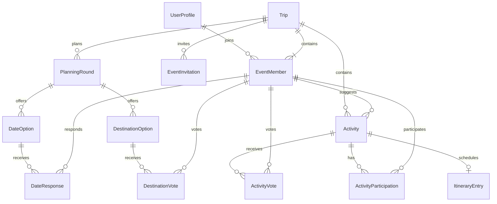

# Evter data model

Status: approved conceptual model as of 2026-10-09; incremental Prisma migrations are implemented and verified per slice.

## Existing state and design rules

The current schema contains only `Trip`: CUID ID, name, destination, start/end DateTime values, optional description, required organizerId (Clerk user ID), and timestamps. Preserve this model name, existing IDs and URLs. The product term is event.

Use Prisma for application access and migrations for all constraints/backfills. Keep identity in Clerk and event roles locally. Primary IDs are CUIDs unless an existing identity is explicitly the key. All mutable records have creation/update timestamps; lifecycle records also record the acting member and event. No financial, booking, travel, or super-admin tables are created for the MVP.

## Proposed entities

| Entity | Main fields | Relationships and invariants |
| --- | --- | --- |
| `Trip` (extend) | Existing fields; nullable destination/startDate/endDate; nullable timeZone; planningStatus PLANNING/FINALIZED; archivedAt; itineraryPublishedAt; version | organizerId remains owner; confirmed details require a destination and ordered complete dates; publication requires finalized, nonarchived event and known zone |
| `UserProfile` | clerkUserId primary key; nullable displayName until onboarding; hometown; bio; encrypted email/phone envelopes | No passwords or Clerk secret data; user edits self; contact envelopes include nonce/tag/key version; do not duplicate Clerk login contacts automatically |
| `EventMember` | id; tripId; userId; role ADMIN/MEMBER; status ACTIVE/LEFT/REMOVED; revision; relationship; partyTitle; shareEmail; sharePhone; joinedAt; endedAt | Unique tripId/userId; userId references UserProfile; owner row is active ADMIN; share flags default false; revision changes when membership is deactivated/reactivated |
| `EventInvitation` | id; tripId; tokenHash; createdByMemberId; expiresAt; revokedAt | Unique tokenHash; link role is not configurable; default expiry 7 days; archived event or revoked/expired token cannot join |
| `PlanningRound` | id; tripId; number; status OPEN/CLOSED; selectedDateOptionId; selectedDestinationOptionId; finalizedByMemberId; finalizedAt | Unique tripId/number; at most one OPEN round per event; selected options belong to this round and event; closed legacy/imported round may have no known finalizer |
| `DateOption` | id; tripId; roundId; startDate; endDate; archivedAt; version | Ordered date-only range; unique exact range within a round; replace an option after responses exist, rather than changing ballot meaning |
| `DestinationOption` | id; tripId; roundId; label; normalizedLabel; notes; archivedAt; version | Nonblank label; unique normalizedLabel per round; optional notes; same immutability rule |
| `DateResponse` | id; tripId; optionId; memberId; membershipRevision; value AVAILABLE/UNAVAILABLE/MAYBE | Unique optionId/memberId/membershipRevision; absent row is unanswered; only current active membership revisions contribute to totals |
| `DestinationVote` | id; tripId; optionId; memberId; membershipRevision; value UP/DOWN | Same uniqueness/revision rules; no implicit vote from final selection |
| `Activity` | id; tripId; createdByMemberId; kind SUGGESTION/MANUAL; title; description; location; referenceUrl; withdrawnAt; version | Suggestions accept votes; manual items are admin-created solely for itinerary use; costs/bookings are future scope |
| `ActivityVote` | id; tripId; activityId; memberId; membershipRevision; value UP/DOWN | Unique activityId/memberId/membershipRevision; only active suggestions accept votes |
| `ActivityParticipation` | id; tripId; activityId; memberId; membershipRevision; status IN/OUT; optional reason | Unique activityId/memberId/membershipRevision; absent row is undecided; independent of votes; reason readable only by author/admins |
| `ItineraryEntry` | id; tripId; activityId; startsAt; endsAt; notes; needsReview; version | Unique activityId (one scheduling per item in MVP); activity must belong to event; valid UTC interval within event-local dates; publication is controlled by Trip |

`Activity` is the shared content/participation identity for suggestions and manual itinerary items. `ItineraryEntry` adds scheduling. Manual items are hidden from the suggestion-voting list, but participate in the agenda like other entries. This avoids separate, competing participation records when a suggestion is scheduled or unscheduled.

The diagram omits actor and selected-option edges for readability; the table and invariants are authoritative.

## Event and publication state

| Operation | Preconditions | Atomic result |
| --- | --- | --- |
| Create draft | Authenticated, valid name/profile | Trip PLANNING; owner membership; round 1 OPEN; confirmed fields null |
| Create confirmed | Complete destination/dates/zone | Trip FINALIZED; owner membership; round 1 CLOSED with generated options and selections |
| Finalize | Active admin; current open round; active selected options | Copy chosen values to Trip; close round and record finalizer/time; increment version |
| Reopen | Active admin; finalized event | Trip PLANNING; retain last confirmed values as provisional; new OPEN round and copied eligible options; no response copies; clear publication; mark all entries needsReview |
| Publish | Active admin; FINALIZED; known zone; valid nonempty reviewed agenda | Set itineraryPublishedAt atomically after rechecking every entry |
| Withdraw itinerary | Active admin; current version | Clear itineraryPublishedAt; retain draft entries and participation |
| Archive/restore | Owner | Set/clear archivedAt; archive disables all other writes; preserve data/publication state for read-only history |

One complete pair of dates or neither is allowed; an end without a start is invalid. A PLANNING event may have provisional values after reopening. FINALIZED requires complete confirmed values. A restored event resumes its pre-archive planning/publication state, but invalid invitation links do not become valid again.

## Constraints, indexing, and authorization joins

- Add event lookup indexes on `EventMember(userId, status)` and role/member lookup on `(tripId, status, role)`, plus the unique `(tripId, userId)` key.
- Index child collections by `(tripId, roundId)` or `(tripId, status/archivedAt/withdrawnAt)` as applicable and itinerary entries by `(tripId, startsAt)`.
- Index invitation lookup by unique token hash and management by tripId. Never use the raw token as the primary key.
- Use composite foreign keys including tripId for child-to-parent/member relations where practical. A valid option/activity/member ID from another event must not be attachable merely because it exists.
- Selected option relationships include roundId/tripId. Create a round first, then its options, then fill nullable selection references during finalization to avoid insertion cycles.
- Implement database checks for date/time ordering and complete confirmed values. Use an SQL partial unique index in a Prisma migration for one OPEN round per trip if the installed Prisma version cannot represent it directly.
- Enforce uniqueness at the database layer for concurrent joins/votes/scheduling. Do not rely on an application pre-check alone.
- Actor/resource ownership, role permissions, encrypted contact visibility, time zone validity, and schedule-within-event validation also require server logic. A foreign key does not establish authorization.
- Public/member query projections never include tokenHash, contact ciphertext, unshared plaintext, private opt-out reasons, or other people's planning responses/totals.

## Retention and mutation rules

Membership rows are retained when someone leaves/is removed so suggestions and decisions keep valid authorship. Increment membership revision on status transitions; new responses use the active revision. Historical rows may be retained, but live totals must filter both active status and matching revision. Rejoining does not reactivate old responses. Clearing a current response deletes only that current-revision response.

Options with responses and withdrawn activities are soft-hidden. Closed planning rounds remain readable under the same privacy rules. Unscheduling removes the ItineraryEntry but retains a suggested Activity and its participation. For a manual Activity, unscheduling also withdraws its content. Editing content that is part of a published schedule requires withdrawing the schedule first.

Archive is the MVP event deletion behavior; no irreversible event cascade deletion UI is shipped. Profile/contact deletion by the user clears the relevant profile fields and immediately removes them from all directories. Formal account erasure, long-term retention policy and audited internal support access remain a pre-public-launch follow-up rather than implied capabilities.

## Incremental migration sequence

1. Restore existing edit action/query with current organizer ownership; no schema change.
2. Add event state, nullable confirmed fields, profile/membership foundations and versioning. Backfill a profile shell and active ADMIN membership for every existing organizer without inventing contact/name data. Existing trips become FINALIZED and keep their values; timeZone stays unknown until chosen. Preserve updatedAt history deliberately during backfill.
3. Add invitation model and constraints when the invitation UI ships.
4. Add optional profile/contact-sharing fields with the actual profile UI and encryption handling.
5. Add planning rounds/options and responses; backfill a CLOSED round and selected options from each existing confirmed trip. Label its finalizer/time as unknown rather than fabricating audit evidence.
6. Add activities, votes and participation with their respective slices.
7. Add itinerary entries and publication state when scheduling ships.

Each migration is checked with production-like fixture data on an isolated branch, including duplicate/invalid-data preflight. Use expand/backfill/constrain ordering; never silently delete trips to satisfy a constraint. No schema file, migration, generated client, or live database has been changed during planning.

## Future extension points

Expenses will need explicit financial rules before schema design: currencies, allocations, honoree exemptions, payer responsibilities, repayments, overrides, and visibility. Represent money with exact minor units/decimals once designed. The overview's cross-category cost table is preserved as a future requirement; avoid choosing an unvalidated table-name/string-ID polymorphic relation now.

Travel, accommodation, supplies, dining, budgets, external bookings and audit records should reference the same event/membership boundary. Dedicated entities and referential integrity can be added per feature. No generic JSON bucket replaces those later models. RBAC is sufficient for this MVP; ABAC and internal super-admin permissions require a separate approved design.
